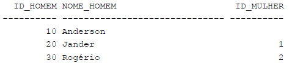
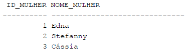
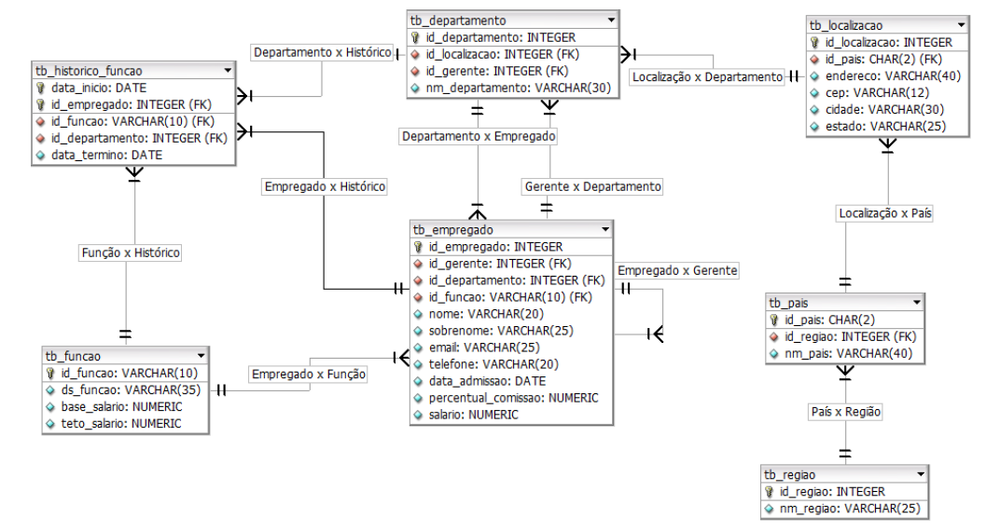

### **Exercício 01**
*Consulte a tabela TB_FUNCAO e retorne uma expressão única da forma “O identificador da <descrição da função> é o ID: <id_funcao>”. Utilize um alias para essa expressão de coluna como “Descrição da Função” usando a palavra-chave AS.*  

### **Exercício 02**
*Usando a tabela DUAL, calcule a área de uma circunferência com um raio de 6000 unidades, com PI sendo, aproximadamente, 22/7. Use a fórmula: Área = pi x raio x raio. Crie um alias no resultado como “Área”.*  

### **Exercício 03**
*Recupere o(s) nome(s) do(s) departamento(s) que termine com as três letras “ing” da tabela TB_DEPARTAMENTO.*

### **Exercício 04**
*A tabela TB_FUNCAO contém descrições de diferentes tipos de funções que um empregado da empresa pode ocupar. Ela contém as colunas ID_FUNCAO, DS_FUNCAO, BASE_SALARIO e TETO_SALARIO. Você precisa escrever uma consulta que extraia as colunas DS_FUNCAO, BASE_SALARIO, e a diferença entre os valores TETO_SALARIO e BASE_SALARIO para cada linha. Os resultados somente podem incluir valores DS_FUNCAO que contenham a palavra “Presidente” ou “Gerente”. Classifique a lista em ordem descendente baseado na expressão DIFERENÇA. Se mais de uma linha tiver o mesmo valor DIFERENÇA, então, em adição, classifique essas linhas por DS_FUNCAO na ordem alfabética reversa.*

### **Exercício 05**
*Para o exercício abaixo, utilize impreterivelmente, variáveis de substituição (& comercial) Um cálculo comum executado pelo Departamento de Recursos Humanos está relacionado ao cálculo de impostos cobrados sobre um determinado empregado. Apesar disso ser feito para todos os empregados, sempre há alguns membros da equipe que discutem os impostos retidos de seus salários. O imposto retido por empregado é calculado obtendo o salário anual do empregado e multiplicando-o pela alíquota atual, que pode variar de ano para ano. Você precisa escrever uma consulta reutilizável usando a alíquota atual e os números ID_EMPREGADO como entradas e retornar as informações ID_EMPREGADO, NOME, SALARIO,SALARIO ANUAL (SALARIO * 12), ALIQUOTA, e ALIQUOTA (ALIQUOTA * SALARIO ANUAL).*

### **Exercício 06**
#### **Para as questões a seguir, utilize o esquema “Homem x Mulher" abaixo:**
  

- #### **6.1 Insira as seguintes tuplas na tabela “homem”**  
  

- #### **6.2 Insira as seguintes tuplas na tabela “mulher”**  
  

- #### **6.3 Todas as questões a seguir utilizarão INNER JOINS:**
    - *a. Selecionar os casamentos*  

    - *b. Selecionar os casamentos utilizando NATURAL JOIN*  
    - *c. Selecionar os casamentos utilizando JOIN...USING*  
    - *d. Selecionar os casamentos utilizando JOIN...ON*  
    - *e. Por meio de um produto cartesiano, simule todos os casamentos possíveis. Existem duas respostas para essa questão, realize ambas*  

- #### **6.4 Todas as questões a seguir utilizarão OUTER JOINS:**
    - *a. Selecionar os casamentos, caso não exista homens casados, é desejável exibi-los*  

    - *b. Selecionar os casamentos, caso não exista mulheres casadas, é desejável exibi-las*  
    - *c. Além do símbolo (+), um OUTER JOIN pode ser realizada por meio da NATURAL OUTER JOIN, OUTER JOIN...USING e OUTER JOIN...ON. Selecionar os casamentos e todos os homens que não estejam casados*  
    - *d. Selecionar os casamentos e todas as mulheres mesmo que não estejam casadas*  
    - *e. Refaça as consultas acima (c e d) usando OUTER JOIN...USING e OUTER JOIN...ON*  
    - *f. Selecionar todos os casamentos e, caso não exista homens e mulheres casados também é desejável exibi-los.*  
    - *g. Refaça a consulta anterior (f) usando OUTER JOIN...USING e OUTER JOIN...ON. Observe que não é possível o uso do símbolo (+).*

### **Exercício 07**
#### **OBSERVAÇÃO: Tendo como base o esquema de banco de dados relacional abaixo representado pela Figura 1, responda adequadamente as questões abaixo.**  
  

- **7.1** *Elabore uma consulta para exibir o nome do empregado, sua respectiva descrição da função e a data de admissão dos empregados admitidos entre o período de 20 de fevereiro de 1987 e 1 de maio de 1989. Ordene a consulta resultante de modo ascendente de maneira posicional pela data de admissão.*  

- **7.2** *Elabore uma consulta para exibir o nome do empregado com todas as letras em maiúsculo, além do tamanho do sobrenome (quantidade de caracteres), nome do departamento e nome do país, para todos os empregados cujo nome inicia-se pelos caracteres B, L ou A. Forneça um label apropriado para cada coluna.*  
- **7.3** *Elabore uma consulta para exibir o nome do empregado, o nome do departamento e sua respectiva localização (cidade e estado) de todos os empegados que recebem comissão.*  
- **7.4** *Realize uma Auto Junção para recuperar o nome de cada empregado juntamente com o nome de seu respectivo gerente. Exemplo: João trabalha para o Tiago. Todos os empregados deverão ser recuperados, sem exceção. Para o empregado que NÃO possuir gerente vinculado, utilize a função apropriada do Oracle para substituir o valor nulo (NULL) do nome do gerente para o STRING “os acionistas”. Ordene de maneira descendente à relação resultante pelo NOME do gerente.*  
- **7.5** *Elabore um procedimento armazenado utilizando a linguagem PL/SQL a qual receberá 1 parâmetro do tipo inteiro, representando o id_empregado. Identifique esse stored procedure de sp_get_emp(p_id integer). O procedimento armazenado deverá retornar o nome completo, juntamente com a descrição da função que o empregado correspondente ao ID informado como parâmetro de entrada (IN) exerce atualmente. Se, eventualmente, o usuário informar um ID de empregado inexistente, exibir uma mensagem informativa.*  
  - **Exemplos:**  
    - ***SET*** *serveroutput* ***ON***  
      ***BEGIN***  
      *sp_get_emp(200); -- invocando o stored procedure*  
      ***END;***  

      *Saída do stored procedure: ***Nome:*** Jennifer Whalen ***Função:*** Assistente Administrativo*

    - ***SET*** *serveroutput* ***ON***  
      ***BEGIN***  
      *sp_get_emp(999); -- invocando o stored procedure*  
      ***END;***  

      *Saída do stored procedure: Empregado ***999*** não localizado!!!*
